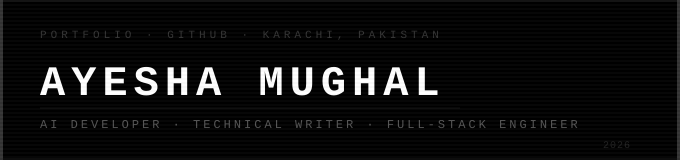

 

---

### `> whoami`

I'm **Ayesha Mughal** — AI developer and technical writer building in public from Karachi, Pakistan.

- 🤖 Specializing in **Claude Code, Agentic AI & Full-Stack Engineering**
- ✍️ Technical writer at **AI in Plain English** — 1M+ views, 1K+ followers
- 🏆 **Top 5** out of 317 — Ramadan Prompting Nights Competition 2026
- 🎓 **Excellence Team & Rising Star** @ GIAIC (Governor's Initiative for AI & Computing)
- 🚀 **AI Seekho 2026** — National Hackathon, PKR 2.5M prize pool
- 🎓 **Stanford Code in Place 2026** — Experienced Student Track
- 💼 **27+ certifications** — Harvard CS50x (9/9), CS50 AI with Python
- 🔭 Currently: **Agentic Engineering Series** — Cursor + Claude Code + v0 + n8n
- 💡 First freelance client: **DeFi QC Multi-Agent System** — Python + Claude API
- 📬 Reach me: ayeshamughal2162@gmail.com

> *"I Engineer It. Then I Explain It."*

 

---

### `> status --live`

&nbsp;

&nbsp;

---

### `> stats --global`

| 📝 **1M+** | 👥 **1K+** | 🔗 **1,150** | 🏅 **27+** | 🥇 **TOP 5** | 💻 **10** |
|:---:|:---:|:---:|:---:|:---:|:---:|
| Medium Views | Medium Followers | LinkedIn Connections | Certifications | RPN 2026 / 317 | Hackathons |

---

### `> cat tech_stack.json`

**Languages**

**Frameworks & Libraries**

**AI & Agentic Engineering**

**Databases & Backend**

**Tools & Cloud**

---

### `> ls projects/ --all`

| # | Project | Stack | Live |
|:---:|:--------|:------|:----:|
| 01 | **ServeEase** — AI Customer Success Employee; 24/7 support via Gmail, WhatsApp & web | OpenAI Agents SDK · FastAPI · Kafka · PostgreSQL | [↗](https://serveease-next.vercel.app/) |
| 02 | **Tareekh-ky-Jhonky** — Pakistani heritage AI scanner with audio walks & inscription translator | Gemini 1.5 Pro · Google ADK · RAG · Next.js · Google Cloud Run | [↗](https://ayesha-mughals-portfolio.vercel.app/) |
| 03 | **Momentum AI** — AI-powered task manager with agent automation | Next.js · AI Agents · LangChain · Tailwind | [↗](https://momentum-ai-todo-app.vercel.app/) |
| 04 | **StudyForge AI** — Personalized flashcards & summaries from raw topics | React · TypeScript · Supabase | [↗](https://study-forge-ai.vercel.app/) |
| 05 | **PromptVault** — Marketplace for high-quality AI prompts | Next.js · Supabase · Framer Motion | [↗](https://prompt-vaulet-get-200-plus-prompts.vercel.app/) |
| 06 | **Audionic Shop** — E-commerce storefront with high-performance interactions | React · TypeScript · Vite · shadcn/ui | [↗](https://audionic-soundscape-shop.vercel.app/) |
| 07 | **SM Marketing** — Real estate platform with interactive lead management | Next.js · React · Tailwind CSS | [↗](https://sm-markeing-real-estate.vercel.app/) |
| 08 | **Humanoid Robotics** — Educational platform for physical AI & robotics | Next.js · React · Tailwind CSS | [↗](https://physical-ai-humanoid-robotics-cours-six.vercel.app/) |
| 09 | **Course Finder** — Search engine for programming courses with advanced filtering | Next.js · API Integration · Tailwind | [↗](https://courses-search-engine-by-ayesha-mughal.vercel.app/) |
| 10 | **Profile Viewer** — GitHub analytics & data visualization tool | React · GitHub API · Chart.js | [↗](https://github-profile-search-app-sage.vercel.app/) |
| 11 | **Sugar Bliss** — Bakery e-commerce with product galleries & order forms | React · Tailwind CSS · Vercel | [↗](https://bakery-website-by-ayesha-mughal.vercel.app/) |
| 12 | **Luxe Interiors** — Premium interior design portfolio | React · Framer Motion · Styled Components | [↗](https://interior-design-website-indol-ten.vercel.app/) |

---

### `> cat writing/ --pinned`

&nbsp;

**Published in [AI in Plain English](https://medium.com/ai-in-plain-english) · 1M+ views · 1K+ followers**

---

  

